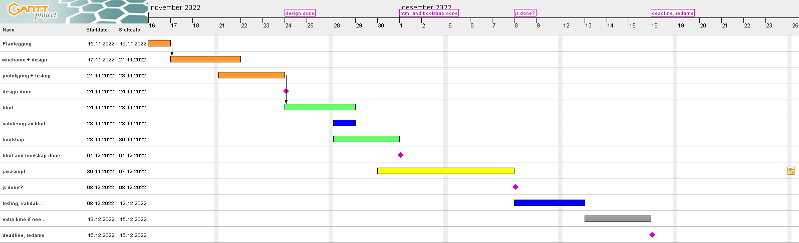
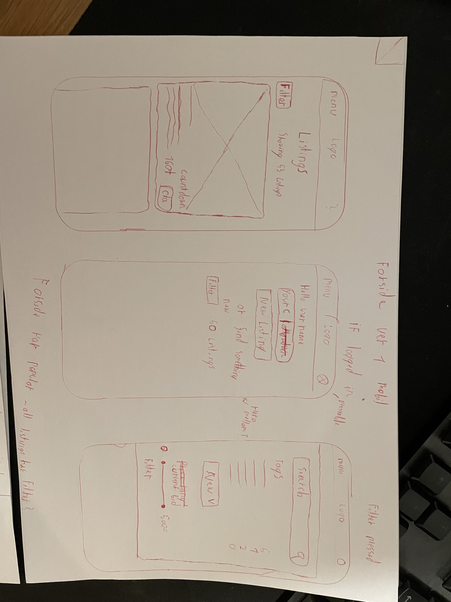
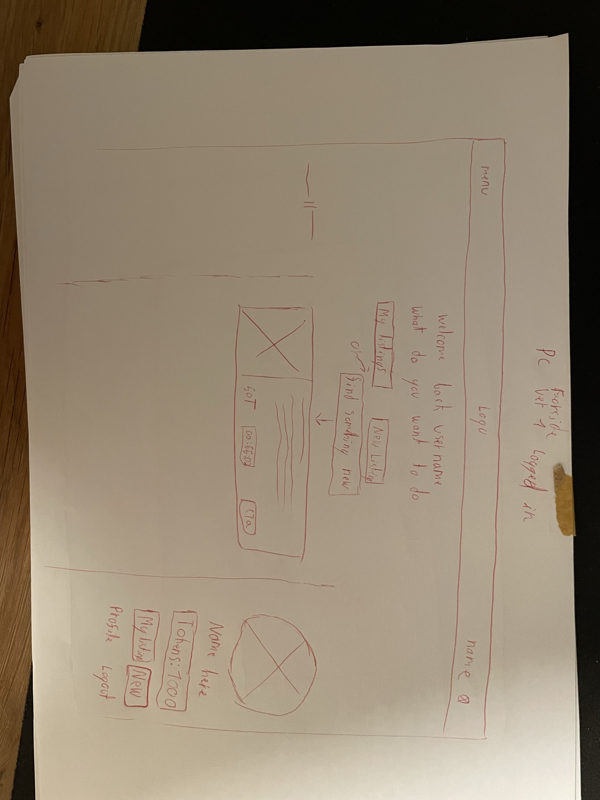
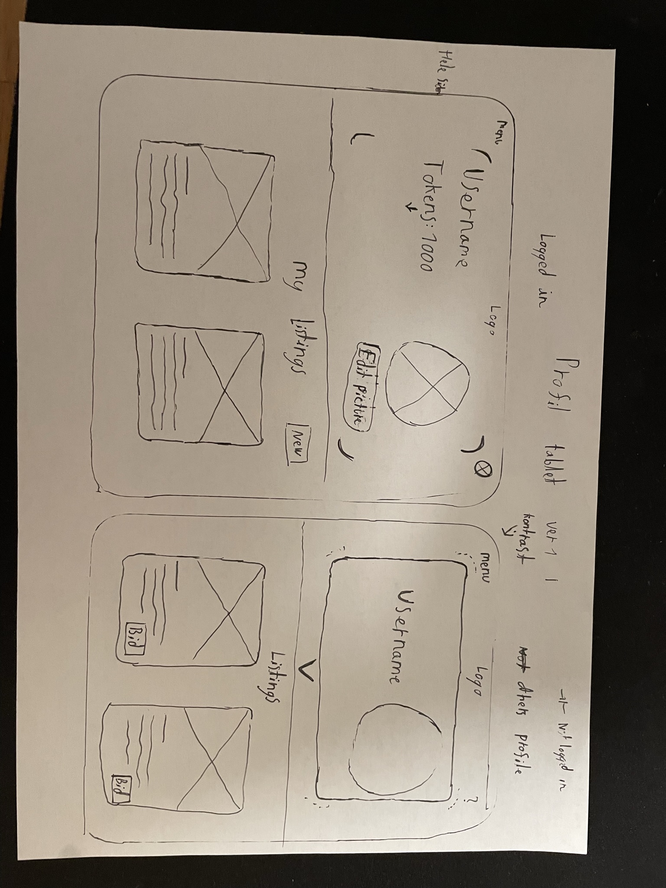

# Semester-Project
This is my semester project where i have created an auction website called Bidder

## Table of contents
* [Setup](#setup)
* [Github Status](#status)
* [Links](#links)
    * [figma](#figma)
        * [prototype](#prototype)
        * [style guide](#style-guide)
        * [design](#design)
        * [wireframes](#wireframes)
    * [github projects(canban)](#github-project-kanban)
    * [gantt project](#gantt-project)
    * [github repo](#github-repo)
    * [github pages](#github-pages-live-site)
    
* [file system](#file-system)
* [design](#design)
    * [Basic design](#basic-design)
    * [css / scss](#css-scss)
    * [bootstrap](#bootstrap)
    * [contrast](#contrast)
* [Javascript](#javascript)
    * [scrapped plans](#scrapped-plans)
* [Planning](#planning)
    * [Wireframes](#wireframes)
    * [planning methods](#planning-methods)

## status
Github Pages: <br>
[](https://github.com/puggen1/Semester-Project/actions/workflows/ghPages.yml)

## setup
for local use, you need to setup the repo like this
when repo is cloned and opened:
run node install
```
npm install
```
setup sass for the latest version
```
npm run sassBuild
```
run liveserver to get preview
```
npm run liveServer
```

## links

### figma
here is the link to both wireframes, design and prototype, as well as styleguide
#### prototype 
https://www.figma.com/file/Uj2mGOpk7Iq7ihJctwvIjY/styletile%2C-design-elements%2C-wireframe-and-design?node-id=70%3A4348&t=FmkQXWsCaZUE1aQ2-1
#### style guide
    https://www.figma.com/file/Uj2mGOpk7Iq7ihJctwvIjY/styletile%2C-design-elements%2C-wireframe-and-design?node-id=42%3A1599&t=FmkQXWsCaZUE1aQ2-1

#### design
https://www.figma.com/file/Uj2mGOpk7Iq7ihJctwvIjY/styletile%2C-design-elements%2C-wireframe-and-design?node-id=63%3A6092&t=FmkQXWsCaZUE1aQ2-1

#### wireframes 
https://www.figma.com/file/Uj2mGOpk7Iq7ihJctwvIjY/styletile%2C-design-elements%2C-wireframe-and-design?node-id=3%3A353&t=FmkQXWsCaZUE1aQ2-1
### github project (kanban)
here is the github project link. on some tasks there is more information inside the task itself. <br>
https://github.com/users/puggen1/projects/4

### gantt project
here is a picture of the gantt project, where you can see the timeline of work process


### github repo
here is the link to the github repo, where you can see the code. <br>
https://github.com/puggen1/Semester-Project

### github pages (live site)
here is the link to the github pages, where you can see the website. <br>
https://puggen1.github.io/Semester-Project/

## file system
the files are divided based on the use of the file, all sort functions are in a folder etc.

## design

### Basic design
the design i made has been a little bit changed from figma to html, but overal it is the same.
even thought it looks a bit boring, i feel it works well with the content. only on some pages it feels not that great.

### css / scss
there is some custom scss added, most if for image sizes and buttons for pc version
the rest is bootstrap
### bootstrap
i used bootstrap for most of the design, and try to have is as close to the original bootstrap examples, but some places i changed it to be better for the content i wanted to show

### contrast
when i first choosed colors and design, i checked the colors for color blind mode and contrast, and everything checked out, but later in the proccess, Google lighthouse says that some of my buttons dont have good enough contrast. I dont really know if this it true or not, it might be two diffrent evaluations?

### logo problem
so my logo is combied between a icon and the name of my page Bidder, the icon is originally form here:
https://www.flaticon.com/free-icon/auction_566710?term=auction&page=1&position=3&page=1&position=3&related_id=566710&origin=tag
but i reworked it in figma to be better as svg(if it became to big it got black border). 
probably not needed but it annoyed me that it happened


## javascript

there is not so many modular files in this project, there are some, but mostly there was no need to make it like that. An example of an modular file is the modal.js. it consists of one function to create all the modalms and just changes key features inside it based on what values you give it.
### scrapped plans
originaly wanted to create an countdown for each listing. but i decided to remove it and only show numbers of day / numbers of hour based on how many was left

I also wanted to add edit and delete post buttons, but scrapped it.

the filters as planned on figma were supposed to have more filters, like filter by tag and price range, but that was way more advanced than i thought. (but thats why the figma design is a bit diffrent.)


## planning
for planning i brainstormed a bit with wireframes and ideas.
### wireframes
here are some of the wireframes early on:



more can be seen in ./assets/readmeAssets/


### planning methods
after / while i was sketching wireframes, i also created an kanban and gantt chart.
the gantt chart was was made early, but not used very much in the end. I only checked the chart sometimes to check is i was up to date.
<br>
the kanban i used a little bit more frequent. i created some checkboxes for javascript, so i could check out what i needed to do. But i did not do this too much, i used the figma design alot to remember what features i wanted