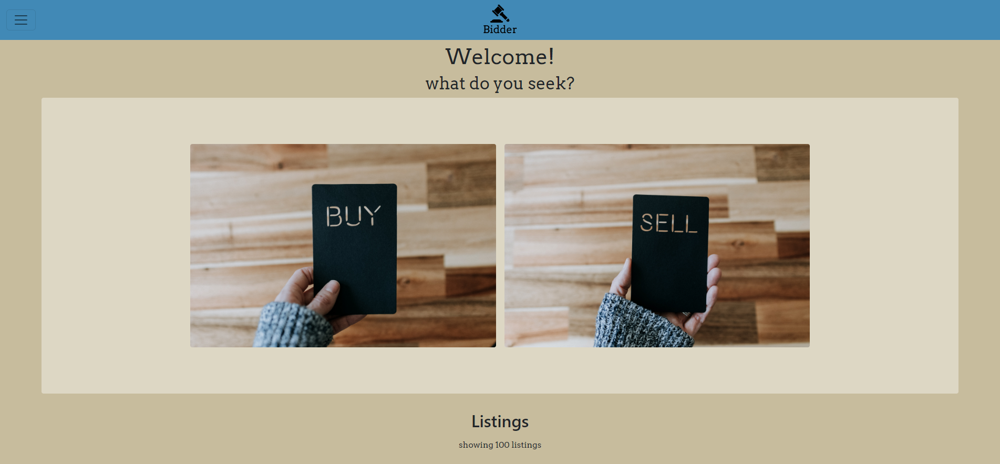

# Semester Project - Bidder



A project for the first semester. The theme was an auction site.

## Table of Contents

- [Links](#links)
- [Description](#description)
- [Built With](#built-with)
- [Getting Started](#getting-started)
  - [Installing](#installing)
  - [Running](#running)
- [Contributing](#contributing)
- [Contact](#contact)

## Links

- [Website](https://puggen1.github.io/Semester-Project/)

## Description

In this project i was tasked with creating an auction website, where you can bid on items, or list your own items for auction.
In this task i had to use an css framework, i choose bootstrap.
The project also relied on an api, wich I got from the school.

there was some requirements for the project, wich was:

- A user with a stud.noroff.no email may register
- A registered user may login
- A registered user may logout
- A registered user may update their avatar
- A registered user may view their total credit
- A registered user may create a Listing with a title, deadline date, media gallery and description
- A registered user may add a Bid to another user’s Listing
- A registered user may view Bids made on a Listing
- An unregistered user may search through Listings

What i had to deliver:

- Gantt chart
- Design prototype
- a style guide
- Kanban project board
- A repository link
- A hosted application demo link

## Built With

- [Bootstrap](https://getbootstrap.com)
- [Sass](https://sass-lang.com)

## Getting Started

### Installing

How to recreate the project:

1. Clone the repo:

```bash
git clone https://github.com/puggen1/Semester-Project.git
```

2. Install the dependencies:

```
npm install
```

### Running

to start the project, do the following:

```bash
npm run sassBuild
```

there might be need of two terminals, one for sass and one for live server.

```bash
npm run liveServer
```

## Contributing

Feel free to contribute if you'd like to!
if you have found a problem, open a new issue.
if you have a solution to a problem, open a new pull request.

## Contact

If you have any questions about the project, or want to contact me, you can do so here:

[LinkedIn Profile](https://www.linkedin.com/in/bendik-kvam)
